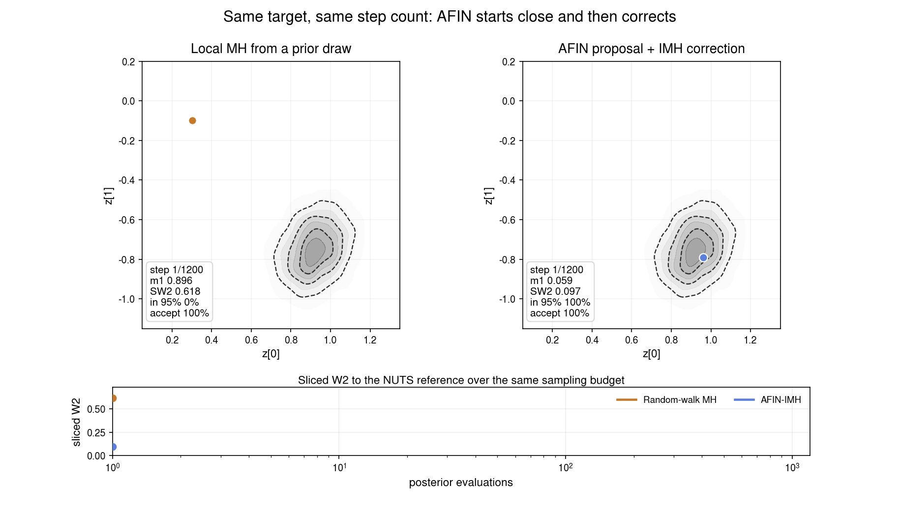
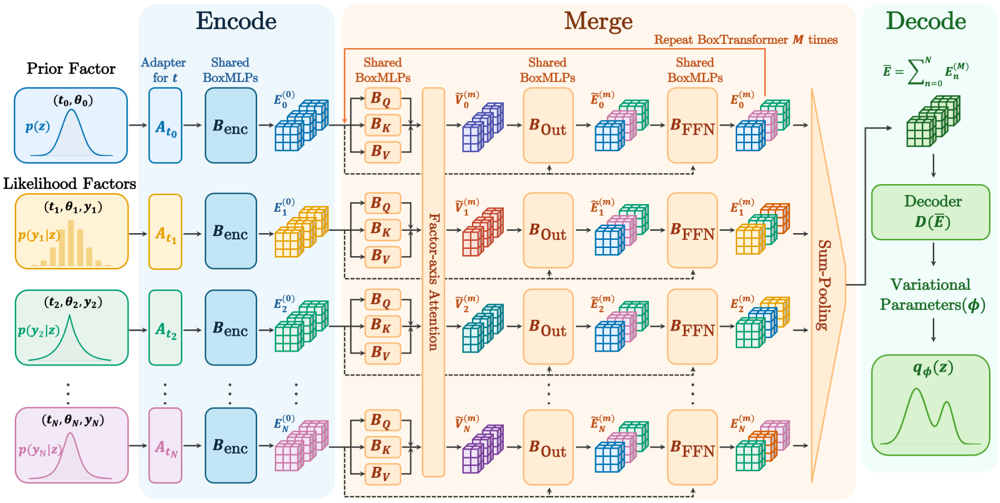

# Amortized Factor Inference Networks (AFINs)

Official repository for **Amortized Factor Inference Networks (AFINs)**.
Paper: [arXiv coming soon](https://arxiv.org/).

AFINs are amortized posterior inference networks for Bayesian models written as
a prior plus observed likelihood terms. Given a model and data, an AFIN returns
an approximate posterior in a single neural-network forward pass.

A single trained AFIN can be applied across different priors, likelihoods,
numbers of observations, and latent dimensions without per-task optimization or
retraining. The returned posterior can be used directly for one-shot inference,
or as a proposal for corrected samplers such as SNIS or independence
Metropolis-Hastings.

## Overview


**Same model, different inference method.** The left terminal uses an AFIN
posterior in one neural pass; the right terminal uses NumPyro NUTS with warmup
and sampling. In this small Gaussian-regression demo, AFIN finishes inference in
about `0.04` seconds, while NUTS takes several seconds (`8.39` seconds in the
recorded run). Exact timings depend on hardware, but the workflow is the same:
write the model once, then swap the inference method.

## Quick Start

Clone the repository:

```bash
git clone https://github.com/joohwanko/AFINs.git
cd AFINs
```

Install [`uv`](https://docs.astral.sh/uv/getting-started/installation/) if you
do not already have it:

```bash
curl -LsSf https://astral.sh/uv/install.sh | sh
# or, without curl:
wget -qO- https://astral.sh/uv/install.sh | sh
```

Create the project environment:

```bash
uv sync
```

Then try the public model API:

```python
from afin import (
    AFIN,
    GaussianPrior,
    LinearGaussian,
    NumPyroNUTS,
    infer,
    make_gaussian_2d_data,
)

gauss_data = make_gaussian_2d_data(seed=4, n=36, sigma=0.35)

prior = GaussianPrior(loc=0, scale=1)
observed = [
    LinearGaussian(
        design_matrix=gauss_data["X"],
        sigma=0.35,
    ).observe(gauss_data["y"]),
]

afin_posterior = infer(AFIN("gaussian"), prior, observed, num_samples=10_000, seed=0)
nuts_posterior = infer(
    NumPyroNUTS(progress_bar=True),
    prior,
    observed,
    num_samples=10_000,
    seed=0,
)
```

`infer(...)` prints a short start/finish line and stores the reported inference
time in `posterior.runtime_seconds`. For AFINs this is the timed neural
posterior forward pass; `posterior.total_runtime_seconds` keeps the full call
time including problem conversion and sample generation. Pass `log_prob=True`
to also attach `posterior.target_log_prob`; AFIN posteriors additionally expose
`posterior.posterior_log_prob` for their own proposal density.

The pretrained checkpoints are hosted on Hugging Face at
[`joohwanko/AFINs`](https://huggingface.co/joohwanko/AFINs):

```python
from pathlib import Path
from huggingface_hub import snapshot_download
from afin import load_afin

root = Path(snapshot_download(
    repo_id="joohwanko/AFINs",
    allow_patterns=[
        "v1-5m-gaussian-d1-16-n1-256/*",
        "v1-5m-flow-d1-16-n1-256/*",
        "README.md",
    ],
))

gaussian_model = load_afin(root / "v1-5m-gaussian-d1-16-n1-256", weights="final")
flow_model = load_afin(root / "v1-5m-flow-d1-16-n1-256", weights="final")
```

## Proposal Sampling



**Corrected sampling.** The same flow posterior can be used as an independence
proposal, so a corrected sampler starts near the posterior mass instead of
searching from a generic prior draw.

## Architecture



AFINs encode prior and likelihood factors, merge them with factor-axis
attention, and decode the pooled representation into variational posterior
parameters. 

## Demo

The notebooks are meant to be read in order:

- [00_one_shot_afin.ipynb](demo/00_one_shot_afin.ipynb): write Bayesian models
  in a small PPL-like interface and compare AFIN posteriors to exact/NUTS
  references.
- [01_afin_as_proposal.ipynb](demo/01_afin_as_proposal.ipynb): use an AFIN as a
  proposal for SNIS and independence MH.
- [02_extending_afin.ipynb](demo/02_extending_afin.ipynb): notes for extending
  the model family, training distribution, and research experiments.
- [03_real_world_logistic.ipynb](demo/03_real_world_logistic.ipynb): build a
  standard-prior Bayesian logistic-regression task from one OpenML dataset.
- [04_standard_prior_openml.ipynb](demo/04_standard_prior_openml.ipynb): reproduce
  the fixed Flow + SNIS OpenML posterior-predictive table.

The figure generators live in [demo/](demo/) and write assets to
[demo/assets/](demo/assets/).

To open the notebooks:

```bash
uv run jupyter lab demo/
```

## Layout

```text
src/afin/          importable package
demo/             notebook, figure scripts, README assets
benchmarks/       heavier OpenML/TabPFN comparison scripts
main.py           compatibility entry point for torchrun
```

## Training

```bash
uv run torchrun --standalone --nproc_per_node=1 -m afin.cli \
  --posterior-family gaussian \
  --num-steps 100000 \
  --encoder-checkpoint --merge-checkpoint
```

```bash
uv run torchrun --standalone --nproc_per_node=1 -m afin.cli \
  --posterior-family flow \
  --num-steps 100000 \
  --encoder-checkpoint --merge-checkpoint
```

Use `uv run python -m afin.cli --help` for the full training options.
